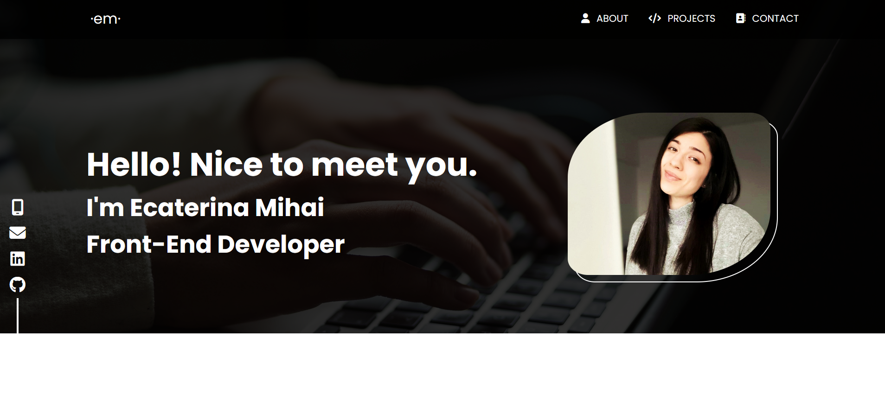
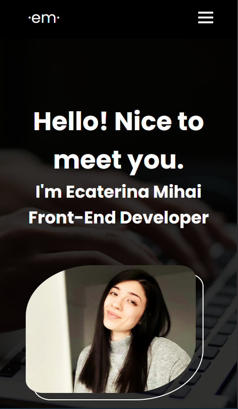

# Portfolio

My very first portfolio after I freshly graduated the Web Development Course at IT School.

## DEMO

To view the project deployed on Netlify, please click on <a href='https://portfolio-project-em.netlify.app' target='_blank'>Resume</a>.

## Table of contents

- [Overview](#overview)
  - [Preview](#preview)
- [The process](#my-process)
  - [Usage](#usage)
  - [Main Features](#main-features)
  - [Built with](#built-with)
  - [What I learned](#what-i-learned)
  - [Useful resources](#useful-resources)
- [Acknowledgments](#acknowledgments)

## Overview

### Preview

This a short preview of the project's view on mobile, tablet and desktop devices.

| DESKTOP SCREEN                                   | MOBILE SCREEN                                   |
| ------------------------------------------------ | ----------------------------------------------- |
|  |  |

## The process

### Usage

This is a portfolio where you can find a brief story about myself, my education and my work.

### Main Features

- View information, skills and projects;
- Access contact for the opportunity of a new connection;

### Built with

- JavaScript (ES6)
- CSS3
- HTML5
- Netlify
- Git
- Getform.io
- IDE (integrated development environment): VS Code;

### What I learned

This project allowed me to increase my knowledge and abilities by applying key concepts like:

- learning and applying JavaScript concepts about Event Delegation, Intersection Observer API, scrollIntoView() method;
- responsive design for desktop, tablet and mobile screens by using CSS FLEXBOX, CSS GRID;
- code modules in different css styles and scripts for better readability and debugging;
- deploying the project on Netlify by using Git and GitHub;
- learning markdown language and creating a README.md document within informations about the project for the users ;

### Useful resources

- [JS Course on Udemy](https://www.udemy.com/course/the-complete-javascript-course/?couponCode=ST14MT32124);
- [MDN](https://developer.mozilla.org/en-US/);
- [Markdown Guide](https://www.markdownguide.org/);

(<a href="#readme-top">back to top</a>)

